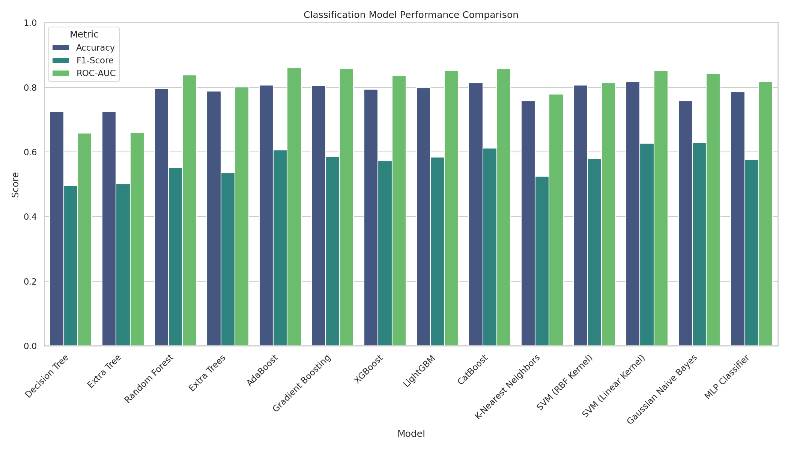
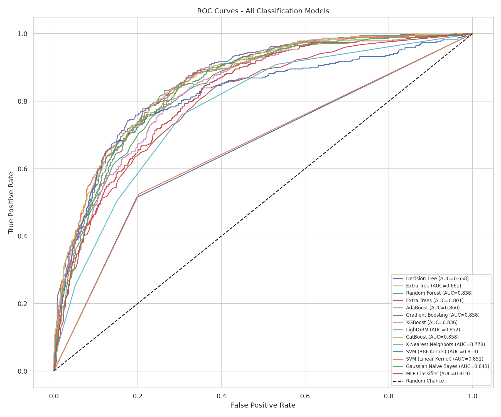
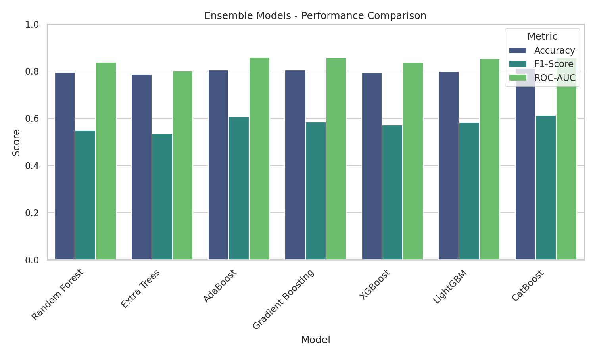
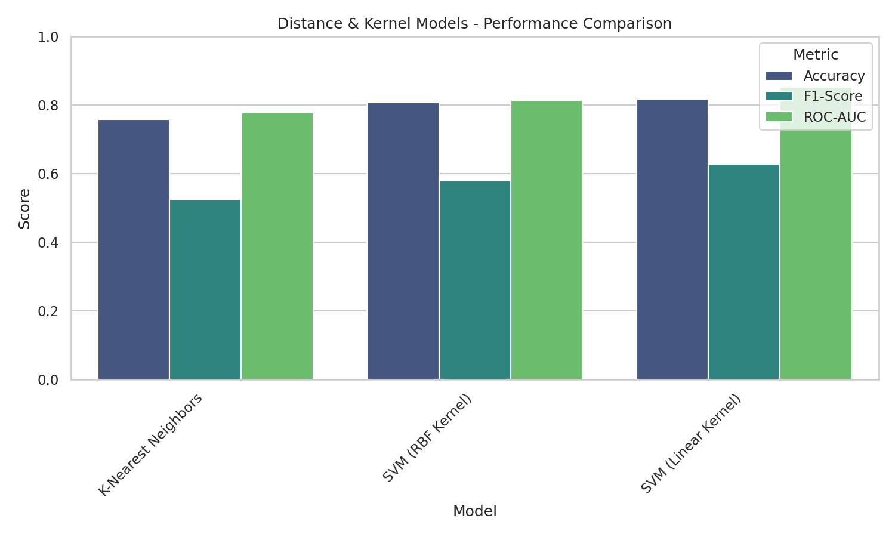
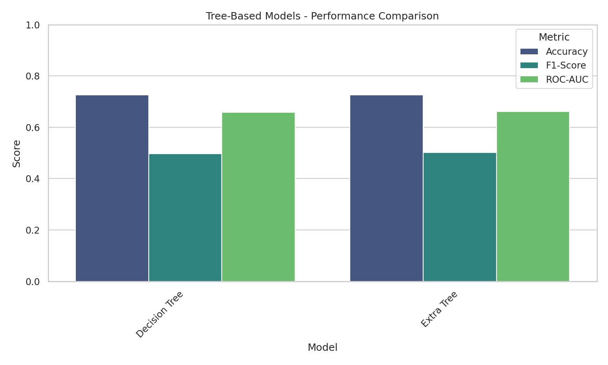

# 🔍 Telco Customer Churn — Multi-Model Classification Benchmark

<div align="center">


</div>

---

## 👥 Team Members

| No. | Name | Student ID |
|-----|------|------------|
| 1 | Antnhe Debebe | ATE/3036/14 |
| 2 | Kalkidan Tadesse | ATE/0652/14 |
| 3 | Eysha Gider | ATE/1084/14 |
| 4 | Yabsra Abera | ATE/1291/14 |

**Course:** Big Data & Machine Learning  
 

---

## 📋 Executive Summary

This project presents a **comprehensive benchmark study** of **14 state-of-the-art classification algorithms** for predicting customer churn in the telecommunications industry. Customer churn prediction is a critical business problem—identifying at-risk customers enables proactive retention strategies that can save millions in revenue.

### 🎯 Project Objectives

1. **Systematic Comparison**: Evaluate multiple classifier families (Tree-based, Ensemble, Distance/Kernel, Probabilistic/Neural) under identical conditions
2. **Rigorous Evaluation**: Use industry-standard metrics (Accuracy, F1-Score, ROC-AUC) for fair comparison
3. **Visual Analysis**: Generate interpretable visualizations (ROC curves, bar charts) to communicate findings
4. **Actionable Recommendations**: Identify the best-performing model for real-world deployment

### 🔬 Methodology

```
┌─────────────────┐    ┌─────────────────┐    ┌─────────────────┐    ┌─────────────────┐
│   Raw Data      │ -> │  Preprocessing  │ -> │  Model Training │ -> │   Evaluation    │
│  (7,043 rows)   │    │  (Scaling, Enc) │    │  (14 Classifiers)│   │  (ROC-AUC, F1)  │
└─────────────────┘    └─────────────────┘    └─────────────────┘    └─────────────────┘
```

### 📊 Key Results Preview

<div align="center">

| 🥇 Best Model | 🎯 ROC-AUC | 📈 Accuracy |
|---------------|------------|-------------|
| **AdaBoost**  | **0.860**  | 80.6%       |

</div>

---

## Model Benchmark Results

We evaluated **14 classification algorithms** across **4 categories** on the Telco Churn dataset.

### 🏆 Top Performers (by ROC-AUC)

| Rank | Category | Model | Accuracy | F1-Score | ROC-AUC |
|------|----------|-------|----------|----------|---------|
| 1 | Ensemble | **AdaBoost** | 0.806 | 0.606 | **0.860** |
| 2 | Ensemble | **CatBoost** | 0.813 | 0.612 | 0.858 |
| 3 | Ensemble | **Gradient Boosting** | 0.806 | 0.586 | 0.858 |
| 4 | Ensemble | **LightGBM** | 0.799 | 0.584 | 0.852 |
| 5 | Distance | **SVM (Linear Kernel)** | 0.817 | 0.627 | 0.851 |

---

### Tree-Based Models

| Model | Accuracy | F1-Score | ROC-AUC |
|-------|----------|----------|---------|
| Decision Tree | 0.726 | 0.496 | 0.658 |
| Extra Tree | 0.725 | 0.502 | 0.661 |

---

### Ensemble Models

| Model | Accuracy | F1-Score | ROC-AUC |
|-------|----------|----------|---------|
| AdaBoost | 0.806 | 0.606 | **0.860** |
| CatBoost | 0.813 | 0.612 | 0.858 |
| Gradient Boosting | 0.806 | 0.586 | 0.858 |
| LightGBM | 0.799 | 0.584 | 0.852 |
| Random Forest | 0.796 | 0.551 | 0.838 |
| XGBoost | 0.794 | 0.572 | 0.837 |
| Extra Trees | 0.788 | 0.535 | 0.801 |

---

### Distance & Kernel Models

| Model | Accuracy | F1-Score | ROC-AUC |
|-------|----------|----------|---------|
| SVM (Linear Kernel) | 0.817 | 0.627 | **0.851** |
| SVM (RBF Kernel) | 0.807 | 0.579 | 0.813 |
| K-Nearest Neighbors | 0.758 | 0.524 | 0.779 |

---

### Probabilistic & Neural Models

| Model | Accuracy | F1-Score | ROC-AUC |
|-------|----------|----------|---------|
| Gaussian Naive Bayes | 0.758 | 0.629 | **0.843** |
| MLP Classifier | 0.786 | 0.577 | 0.819 |

---

### Analysis

**Key Findings:**

1.  **Ensemble methods dominate**: AdaBoost achieved the best ROC-AUC (0.860), followed closely by CatBoost and Gradient Boosting.

2.  **Tree-based models underperform alone**: Single Decision Tree and Extra Tree classifiers had the lowest scores, highlighting the importance of ensembling.

3.  **SVMs are competitive**: SVM with a linear kernel (0.851) performed strongly among non-ensemble methods.

4.  **Naive Bayes is surprisingly good**: Gaussian NB achieved 0.843 ROC-AUC with very fast training.

**Recommendation**: For this churn prediction task, **AdaBoost** or **CatBoost** are the best choices for high performance. For faster inference, **SVM (Linear)** or **Gaussian NB** are good alternatives.

### 📈 Visual Analysis

#### Figure 1: Overall Model Comparison
*Bar chart comparing Accuracy, F1-Score, and ROC-AUC across all 14 classification models. Ensemble methods (right side) consistently outperform single tree classifiers (left side).*



---

#### Figure 2: ROC Curves — Discriminative Power
*Receiver Operating Characteristic curves for all models. The closer a curve is to the top-left corner, the better the model distinguishes between churners and non-churners. AdaBoost (AUC=0.860) shows the best discriminative ability.*



---

#### Figure 3: Ensemble Models — Detailed Comparison
*Focused comparison of the 7 ensemble methods. AdaBoost and CatBoost lead, while Extra Trees lags behind despite being an ensemble.*



---

#### Figure 4: Distance & Kernel Models
*Comparison of KNN and SVM variants. SVM with Linear Kernel significantly outperforms the RBF variant on this dataset.*



---

#### Figure 5: Tree-Based Models (Single Trees)
*Decision Tree and Extra Tree classifiers perform poorly on their own, highlighting why ensemble methods are preferred.*



---

## Project Objectives

1. Build a reproducible ML pipeline for churn prediction  
2. Train and evaluate multiple classification algorithms  
3. Compare models using standard metrics and statistical significance tests  
4. Provide interpretable insights on feature importance  
5. Recommend the best-performing model for business use  

---

## Dataset

**Source:** Telco Customer Churn  

- Kaggle: https://www.kaggle.com/datasets/blastchar/telco-customer-churn  
- IBM CSV: https://raw.githubusercontent.com/IBM/telco-customer-churn-on-icp4d/master/data/Telco-Customer-Churn.csv  

**Features:**  

- Numeric: tenure, MonthlyCharges, TotalCharges  
- Categorical: Gender, InternetService, PaymentMethod, Contract  
- Target: Churn (Yes/No)  

**Size:** 7,043 records  

Place the CSV in `data/telco_churn.csv`.

---


## Installation

1.  **Clone the repository** (if you haven't already):
    ```bash
    git clone https://github.com/AntnheD/Clasification-Algorithm_comparision.git
    cd Clasification-Algorithm_comparision
    ```

2.  **Create and activate a virtual environment**:
    ```bash
    python3 -m venv venv
    source venv/bin/activate  # On Windows: venv\Scripts\activate
    ```

3.  **Install dependencies**:
    ```bash
    pip install -r requirements.txt
    ```

4.  **Dataset Setup**:
    - The dataset `WA_Fn-UseC_-Telco-Customer-Churn.csv` is located in the `data/` directory.
    - If it's missing, download it from [Kaggle](https://www.kaggle.com/datasets/blastchar/telco-customer-churn) and place it in `data/telco_churn.csv`.

## Usage

1.  **Preprocessing**:
    Run the preprocessing module to verify data loading and splitting:
    ```python
    from src.preprocessing import load_and_preprocess_data
    X_train, X_test, y_train, y_test = load_and_preprocess_data('data/telco_churn.csv')
    print("Training set shape:", X_train.shape)
    ```

2.  **Jupyter Notebooks**:
    Launch Jupyter to explore the analysis:
    ```bash
    jupyter notebook
    ```
    Open `analysis.ipynb` (or create a new one in `notebooks/`) to start your experiments.

## Repository Structure

```
├── data/               # Dataset directory
│   └── telco_churn.csv # Raw CSV data
├── notebooks/          # Jupyter notebooks for experiments
├── src/                # Source code for pipelines
│   └── preprocessing.py# Data cleaning and splitting
├── venv/               # Virtual environment (gitignored)
├── .gitignore          # Git ignore rules
├── requirements.txt    # Python dependencies
└── README.md           # Project documentation
```
